# ASIC Craps Game Controller: RTL, Physical Design, CTS, and STA

This repository presents an ASIC implementation flow for a Verilog-based craps/dice game controller. The project starts from RTL design and functional simulation, then moves through synthesis, physical design stages, clock tree synthesis, and static timing analysis.

The game controller is implemented using a finite state machine (FSM). The initial dice roll is checked for direct win/loss conditions. If the first roll does not immediately decide the game, the design stores a point value and continues evaluating later rolls.

## Game Rules Implemented

| Condition | Result |
|---|---|
| Initial roll = 7 or 11 | Win |
| Initial roll = 2, 3, or 12 | Lose |
| Other initial roll | Store as point |
| Later roll = point | Win |
| Later roll = 7 | Lose |
| Otherwise | Continue game |

## Tools Used

| Stage | Tool |
|---|---|
| RTL Design | Verilog |
| Functional Simulation | ModelSim |
| Logic Synthesis | Synopsys Design Compiler |
| Physical Design | Synopsys ICC2 |
| Static Timing Analysis | Synopsys PrimeTime |

## Repository Structure

```text
asic-craps-game-rtl-physical-design/
├── README.md
├── .gitignore
├── rtl/
│   └── dice_game.v
├── tb/
│   └── dg_tb.v
├── images/
│   ├── 01_block_architecture.png
│   ├── 02_fsm.png
│   ├── 03_rtl_architectural_view.png
│   ├── 04_simulation_waveform.png
│   ├── 05_synthesis_timing.png
│   ├── 06_synthesis_area.png
│   ├── 07_synthesis_power.png
│   ├── 08_import_design.png
│   ├── 09_floorplan.png
│   ├── 10_powerplan.png
│   ├── 11_place_before_legalization.png
│   ├── 12_place_after_legalization.png
│   ├── 13_cts.png
│   ├── 14_hold_violations.png
│   ├── 15_example_violated_path.png
│   ├── 16_violated_path_after_fix.png
│   ├── 17_no_violations.png
│   └── 18_check_timing.png
├── reports/
│   ├── synthesis_summary.md
│   ├── physical_design_summary.md
│   └── sta_summary.md
└── docs/
    └── project_notes.md
```

## RTL Architecture

The design contains dice inputs, adder logic, test logic, point storage, comparator logic, and FSM-based control.

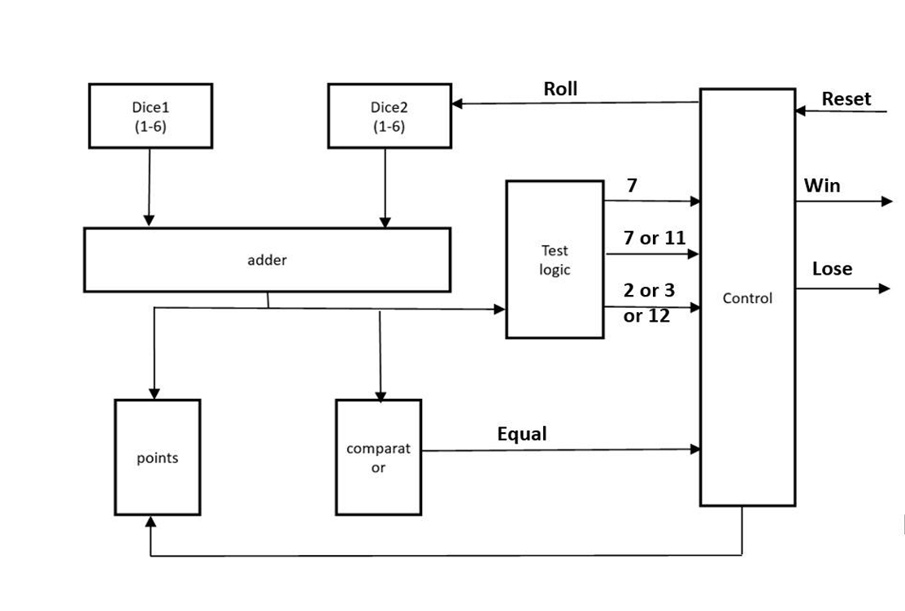

## FSM Design

The FSM uses three major states:

| State | Function |
|---|---|
| S0 | Reset/wait for roll |
| S1 | Evaluate first dice roll |
| S2 | Continue gameplay using stored point |

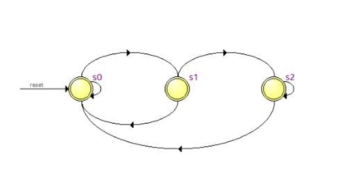

## RTL Architectural View

The synthesized RTL architectural view shows the datapath and control logic generated from the Verilog design.

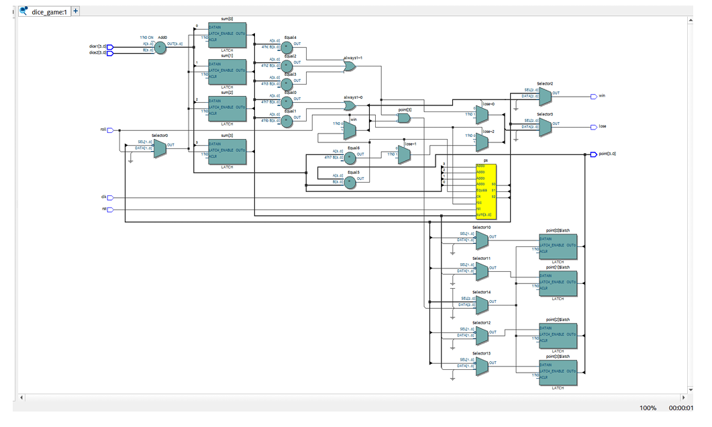

## Functional Simulation

The design was verified using a Verilog testbench. The simulation checks dice roll outcomes, win/loss generation, and point storage behavior.

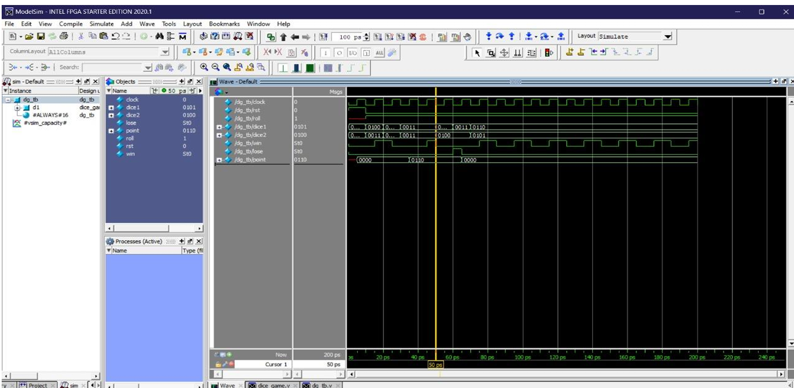

## Synthesis Results

The design was synthesized using Synopsys Design Compiler. Timing, area, and power reports were generated after synthesis.

| Report | Screenshot |
|---|---|
| Timing | `images/05_synthesis_timing.png` |
| Area | `images/06_synthesis_area.png` |
| Power | `images/07_synthesis_power.png` |

### Timing Report

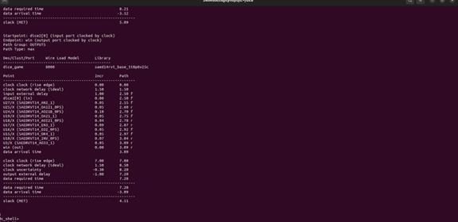

### Area Report

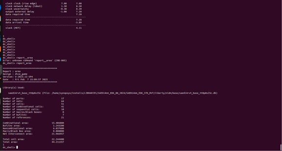

### Power Report

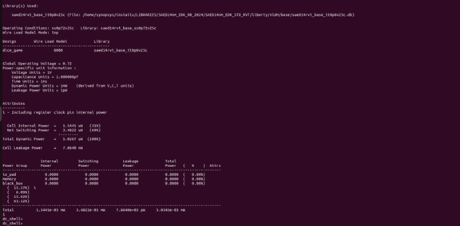

## Physical Design Flow

The physical implementation flow was carried out using Synopsys ICC2. The flow includes design import, floorplanning, power planning, placement, legalization, and CTS.

## Design Import

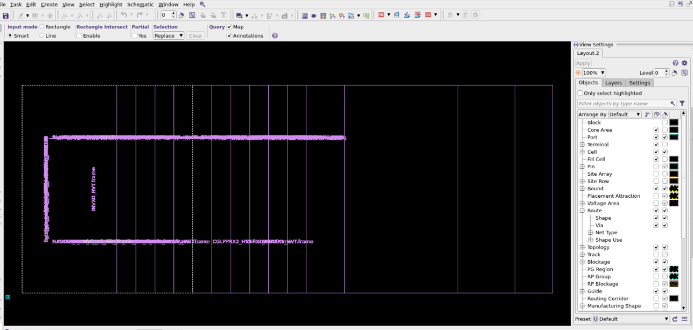

## Floorplan

The floorplan stage defines the initial physical structure of the design, including the core area, standard-cell region, and placement constraints.

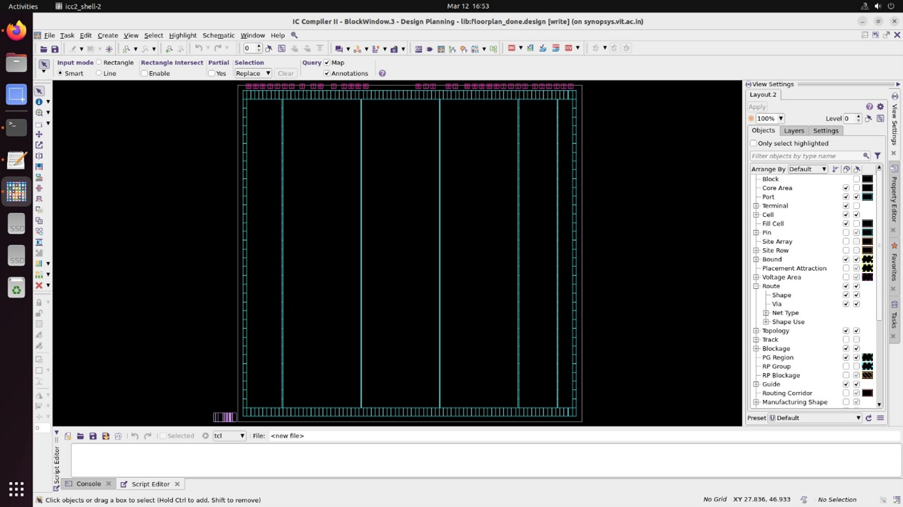

## Powerplan

The power planning stage creates the power distribution network required for VDD/VSS delivery across the design.

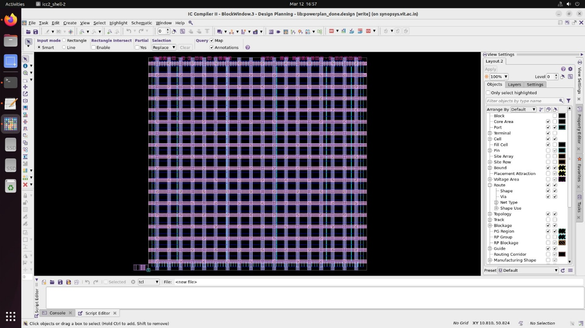

## Placement

Placement was performed before and after legalization. Legalization ensures that standard cells are placed on valid sites without overlap.

### Before Legalization

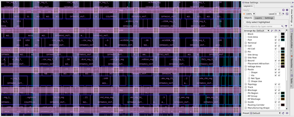

### After Legalization

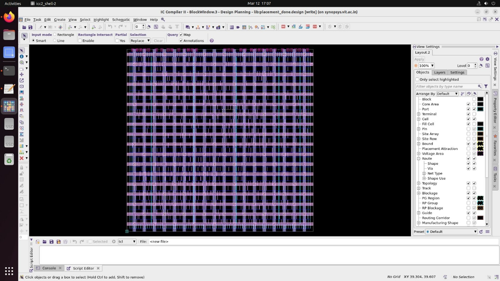

## Clock Tree Synthesis

Clock Tree Synthesis was performed to distribute the clock signal across sequential elements while controlling skew and insertion delay.

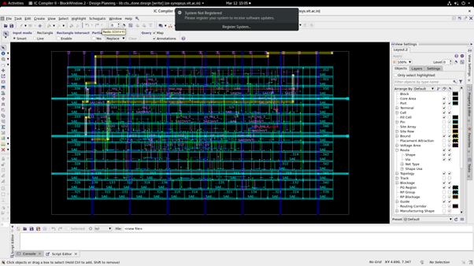

## Static Timing Analysis and Hold Fix

PrimeTime was used for static timing analysis. Initial analysis showed hold violations. Buffer insertion was applied to fix violated hold paths.

### Hold Violations Before Fix

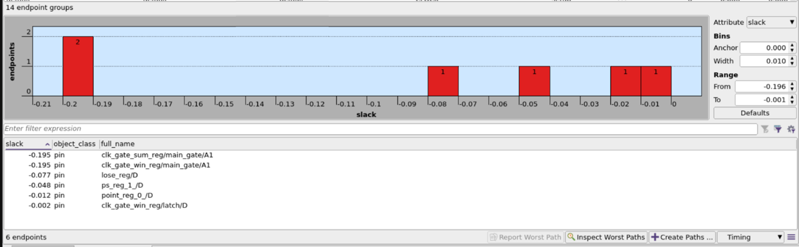

### Example Violated Path

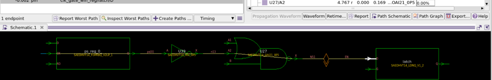

### Path After Buffer Fix

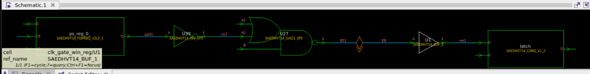

### No Violations After Fix

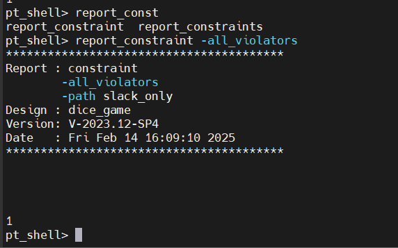

### Check Timing

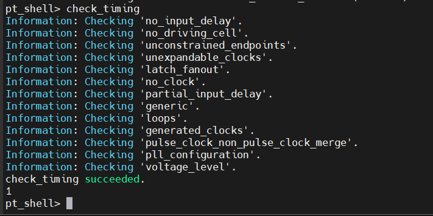

## Summary

| Stage | Outcome |
|---|---|
| RTL Design | FSM-based craps game controller implemented in Verilog |
| Simulation | Dice game functionality verified using testbench |
| Synthesis | Timing, area, and power reports generated |
| Physical Design | Design import, floorplan, powerplan, placement, and CTS completed |
| STA | Hold violations analyzed and fixed using buffer insertion |

## Notes

This repository is a cleaned portfolio version of the ASIC design lab project. It contains RTL, testbench, selected implementation screenshots, and summarized reports.

Raw tool databases, technology libraries, foundry files, generated netlists, and confidential setup files are not included.
